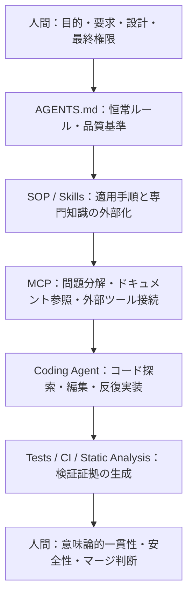

# 『AIなしで手書きできますか？』は何を測っているのか

## ――AGENTS.md・MCP・Skillsでつくる認知的外骨格

## はじめに

IT特化を掲げる就労支援の面談で、私はおおむね次のような趣旨のことを言われました。

> **「AIを使うとしても、コードを手で書けることは必要です」**

ここでいう「手書き」とは、コーディングエージェントによる実装支援を使わず、本人がエディタへ直接コードを入力することを指します。

一般論として、コードを読めること、基礎的な構文を理解していること、生成物の誤りを見抜けることは当然必要だと思います。

しかし、[NousResearch/Hermes-Agent](https://github.com/NousResearch/Hermes-Agent) への継続的なコントリビューションに加え、派生プロジェクト [`zapabob/hermes-agent-windows`](https://github.com/zapabob/hermes-agent-windows) でのWatchdog、プロセス所有権、再起動・回復機構の実装、AIコードレビュー、回帰テスト、CI、セキュリティ境界の検討まで行っている人に対し、主な評価軸として「AIを外して手打ちできるか」を置くのは、現在の開発実務を正確に測っているのでしょうか。

私は日常的にコーディングエージェントを使います。ただし、単にチャット欄へ「これを作って」と入力しているわけではありません。

* **AGENTS.md** に恒常的な規則を置く
* **SOP（標準作業手順書）** で着手条件・セキュリティ・検証・完了条件を定義する
* **Skills** として専門手順を再利用可能にする
* **MCP（Model Context Protocol）経由で接続した Sequential Thinking ツール** で問題分解を補助する
* **Context7 等** で関連するライブラリ文書を取得し、重要な仕様は公式ドキュメントや現行ソースコードと照合する
* **GitHub、テスト、型検査、静的解析、CI** で生成結果を検証する
* **最後の設計判断、リスク受容、マージ可否** は人間が持つ

これは「AIにコードを書いてもらう」という一文では表現できません。

私にとっては、ソフトウェア工学のための**認知的外骨格（Cognitive Exoskeleton）**です。

---

## 私が作っているのは、プロンプトではなく開発統制系である

今回、私がコーディングエージェントへ毎回読ませているSOP群を数えると、執筆時点で **20ファイル・合計801行** ありました。

入口となる `SOP-Implementation-Start-Gate.md` では、実装前に次を要求しています。

1. PC全体とプロジェクトローカルの `AGENTS.md` を読む
2. プロジェクト内の設計文書、セキュリティ文書、実装ログを探索する
3. タスクに適用するSOPとSkillを選ぶ
4. 要件、制約、受け入れ条件、検証方法、残余リスクを明示する
5. 適用基準が不明・矛盾・不足している間は実装を始めない

共通規格では、さらに次を課しています。

* 要求から実装、検証証拠までを追跡可能にする
* 小さく可逆な変更を優先し、ロールバック経路を持つ
* 新しい証拠なしに「完了」と主張しない
* 挙動変更にはテストを要求する
* 省略した検証、その理由、残余リスクを記録する
* 例外を握りつぶさず、失敗を観測可能にする
* 重要な設計判断はADR（Architecture Decision Record）として残す

セキュリティSOPには、資産、権限、信頼境界、攻撃者入力、秘密情報、依存関係、プロンプトインジェクション、データ流出、危険なツール利用まで含めてあります。

Pythonなら `uv`、`pytest`、型ヒント、境界検証、lint・format・testの完了条件を定義する。TypeScriptなら strict mode、runtime schema validation、型検査、ブラウザ検証を要求する。LLMOpsやMLOpsでは、プロンプト、モデル、データ、評価セット、ロールバックまで版管理する。

これはコード生成の依頼文（プロンプト）ではありません。

**何を実行してよいか、何を証拠とし、どこで止まり、誰が責任を持つかを定義した統制系**です。

---

## 各レイヤーは何を担っているのか

私の環境を分解すると、次のようになります。

| レイヤー | 工学上の役割 | 認知上の役割 |
| :--- | :--- | :--- |
| **AGENTS.md** | 恒常ポリシー、禁止事項、品質基準 | 毎回すべてを思い出す負荷を外部化する |
| **SOP** | 着手・実装・検証・完了の標準手順 | 手順抜けと順序混乱を防ぐ |
| **Skills** | 専門作業を再利用可能な単位にする | 一度構築した解法を再現できるようにする |
| **MCP経由のSequential Thinking** | 問題分解と段階的な検討 | ワーキングメモリ上の同時保持を減らす |
| **Context7 等** | ドキュメント参照・仕様取得 | 記憶や思い込みだけに依存せず、参照元を確認する |
| **Coding Agent** | 探索、編集、実装、反復 | 入力・切替・定型作業の負荷を下げる |
| **Tests / CI / Static Analysis** | 生成結果の外部検証 | 見落としを人間の注意力だけに依存させない |
| **人間** | 要求、設計、例外判断、最終承認 | 意味と責任を保持する |

これを制御構造として図式化すると、以下のようになります。

人間が消えているのではありません。

人間の仕事が、**「キーボードから一文字ずつ入力すること」から、「開発系全体を設計し、出力を検証し、責任を負うこと」へ移っている**のです。

---

## 発達障害者にとっての「認知的外骨格」

私はASD・ADHDの特性があり、難しい技術問題を深く追究することはできても、複数の小タスク、頻繁なコンテキストスイッチ、曖昧な指示、複数の手順を同時にワーキングメモリへ保持し続ける作業では負荷が急激に跳ね上がります。

これは「難しいことができるのだから、簡単なことも当然できるはずだ」という一方向の物差しでは説明できません。

私のツールチェーンは、次の機能を外部化しています。

* **忘れてはいけない規則の保持**（AGENTS.md）
* **問題の順序立てと分解**（Sequential Thinking）
* **現在位置と未完了事項の管理**（Todoリスト・Gate管理）
* **最新仕様の探索と照合**（MCP / Context7）
* **定型的な構文入力作業**（Coding Agent）
* **検証チェックの反復**（CI / 自動テスト）
* **作業記録と証拠保存**（SOP / ADR / 実装ログ）

その結果、私自身は、**要求、アーキテクチャ、意味論的一貫性、セキュリティ境界、テスト設計、失敗時の意思決定**に集中できます。

もちろん、生成AIと眼鏡・車椅子がまったく同一だと言いたいわけではありません。生成AIは出力内容を能動的に提案し、ときに誤った実装も生成するため、監査、権限管理、検証、責任分界が必要です。それでも、「障壁となる機能を外部で補い、本人が持つ能力を実際の成果として発揮できるようにする」という機能的な側面では、補助技術として共通する構造があります。

この意味で、眼鏡や車椅子との機能的アナロジーは成立すると考えています。

> **眼鏡は文章の意味を理解しない。** 視覚上の障壁を減らし、本人が読む力を使えるようにする。
>
> **車椅子は目的地を決めない。** 移動上の障壁を減らし、本人が選んだ場所へ到達できるようにする。
>
> **同様に、コーディングエージェントは要求の正しさや、リスクを受容してよいかを最終決定しない。** だが、実行機能、入力、探索、手順保持の障壁を減らし、本人の設計能力や検証能力を成果として外へ出せるようにする。

---

## 「AIなしで手書き」は、何を測っているのか

AIを禁止して白紙からコードを書かせれば、確かにいくつかの能力は測れます。

* 構文や標準ライブラリの暗記量
* 補完なしでの入力速度
* 無支援状態でのワーキングメモリの広さ
* 小規模問題を短時間で解く試験適応力

しかし、それだけで次のような実務上の重要事項を十分に測れるわけではありません。

* 大規模コードベースを横断して根本原因を特定できるか
* 変更が既存の意味論を壊していないか判断できるか
* 信頼境界や権限モデルを安全に設計できるか
* 壊れにくく再現性のある回帰テストを設計できるか
* CIの失敗ログから真因を切り分けられるか
* 不確実で危険な変更を検知してロールバック・中止できるか
* 長期間保守可能な差分を作れるか
* **AIがもっともらしく間違えたときに見抜けるか**

実務で本当に価値があるのは、単なる手打ちの入力速度ではなく、概ね次の総体です。

1. **問題設定**
2. **要求の明確化**
3. **アーキテクチャ設計**
4. **実装手段の選択**
5. **生成物の徹底的なレビュー**
6. **テストと検証証拠の確保**
7. **セキュリティとリスクの判断**
8. **運用・障害回復の設計**
9. **結果への責任**

そのため、通常業務で当たり前に使う道具を試験のときだけ外し、その「丸腰の状態」を主たる評価軸にしてしまうと、**職務遂行能力そのものよりも「無支援状態への耐性（ワーキングメモリの負荷耐性）」ばかりを測ることになりやすい**のです。

航空機のパイロットにも、手動操縦や自動系が故障した場合の対応能力は必要です。しかし、計器、チェックリスト、航法装置、自動操縦をすべて外した状態の成績だけで、職務遂行能力全体を判定するわけではありません。重要なのは、各装置を正しく理解し、異常を早期に検出し、必要なら自動系をオーバーライドして、安全な判断を下せることです。

現代のソフトウェア開発でも、まったく同じではないでしょうか。

---

## もちろん「AIを使えば誰でもエンジニア」ではない

ここを誤解してはいけません。

AIは平気で存在しない架空のAPIを捏造します。古い仕様を混ぜます。セキュリティ境界を越えます。テストを都合よく弱めてパスさせようとします。エラーを握りつぶします。依頼されていない無関係なファイルまで勝手に変更します。そして、とても自信ありげに「完了しました」と報告してきます。

だからこそ私は、**AIを信用するのではなく、信用しなくても運用できる仕組み**を作っています。

* **変更範囲の厳格な制限**（Blast Radiusの最小化）
* **適用ルールの先行読み込み**（AGENTS.md / SOPの強制）
* **一次資料の明示的参照**（公式ドキュメント、ソースコード、現行ログ）
* **生成差分の全件レビュー**（人間による意味論の精査）
* **挙動変更に対する回帰テストの義務化**
* **型検査（Typecheck）・Lint・CIの全パス**
* **省略した検証と残余リスクのドキュメント記録**
* **未検証・不明な状態でのマージ禁止**

AIの出力を読めず、誤りを論理的に説明できず、検証の仕組みも作れない状態と、エージェントを厳格に統制して成果に責任を持つ状態は、天と地ほど違います。

「AIを使ったか、使わなかったか」という**粗い二分法**ではなく、次を問うべきです。

> **「AIを含む開発系全体を、どこまで深く理解し、制御し、検証し、説明できるか」**

---

## 採用や就労支援で本当に見てほしいこと

コーディングエージェントを日常的に使いこなす人を評価・測定するなら、私は次のような実技試験がはるかに実務的で妥当だと考えています。

1. **普段許可されているツール（Agent、CLI、エディタ）を使って、小さな実リポジトリの課題に取り組む**
2. **課題に対する要求と受け入れ条件（Acceptance Criteria）を明文化する**
3. **エージェントが出力した不適切な差分やセキュリティリスクを最低1つ見つけ出し、理由を説明して修正させる**
4. **回帰テストを追加し、グリーンになることを証明する**
5. **アーキテクチャ・保守性・セキュリティ境界・ロールバック計画を口頭または文書で説明する**
6. **最後に、「どの検証証拠をもって完了と判断したか」を提示する**

これであれば、AIを使えるという表面的な事実だけでなく、「AIに振り回されずに主導権を握り、品質に責任を持てるか」という本質的なエンジニアリング能力を正確に測ることができます。

そして、障害者雇用や就労支援の現場においては、さらに本質的な視点があります。

> **「補助を外しても健常者と同じように平均的に振る舞えるか」を測るのではなく、**
> **安全に許可された補助具（認知的外骨格）を最大限に活用した状態で、どのような価値を継続的に生み出せるかを測るべきではないでしょうか。**

企業側のセキュリティやガバナンスへの懸念についても、Enterprise契約、ローカルモデル、機密データの投入制限、アクセス制御、監査ログ、承認済みツールの限定など、リスクを低減するための技術的・運用的な選択肢があります。もちろん、扱うデータの機密区分や業界規制に応じた個別審査は必要です。

必要なのは「全面禁止」か「野放しの無制限利用」かの極論ではなく、**統制された安全な運用設計**です。

---

## おわりに

面談で「AIなしで手書きできますか」と問われたこと自体が、悪意によるものだとは思いません。基礎知識の有無や、非常時における最低限の自走力を確かめたい場面があるのも理解できます。

ただし、それをエンジニアとしての適性や能力判定の中心に据え続けるのであれば、その測定設計は現代の開発現場の実態から乖離してしまいます。

私は、`AGENTS.md`、SOP、Skills、MCP、Sequential Thinking、Context7、Coding Agent、自動テスト、CIを組み合わせ、自分の認知特性に適合する強固な開発環境を構築しています。

これは能力を偽装するための仕組みではありません。

**認知的障壁を外部化し、本人が持っている本来の設計力・分析力・問題解決力を、再現性のある安全な成果へと変換するための仕組み**です。

補助具を外した状態で、どれだけ不便に耐えられるかを競うのか。  
それとも、補助具を適切に使いこなし、どれだけ安全で説明可能な価値を社会に提供できるかを評価するのか。

これからのAI時代における採用や就労支援では、少なくとも後者を正式な評価対象として扱う必要があると考えています。

:::message
（付記：本記事の作成・推敲・検証・公開作業自体も、`AGENTS.md`、SOP、コーディングエージェント、人間によるレビュー、構文検証、実装ログ保存からなる同じ開発統制プロセスを用いて実施されています）
:::
