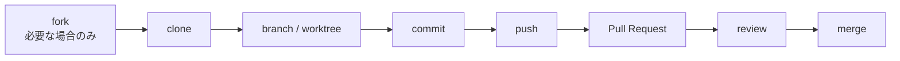

AIに自然言語で要望を伝え、生成されたコードを中心に開発を進めるスタイルを、この記事では「Vibe Coding」と呼びます。GitHub CopilotやCursorのおかげで、最初のアプリが動くところまでは驚くほど早く進めます。

その一方で、「gitとGitHubは同じもの？」「Pull Requestはなぜ必要？」「AIが壊したコードをどう戻す？」という疑問は残りがちです。

この記事は、AIが安全に働けるリポジトリを設計するという視点を、gitとGitHubの基礎まで戻って整理する入門編です。

## 1. git ≠ GitHub：5分で理解する

gitは、自分のPC上でファイルの変更履歴を記録するバージョン管理ツールです。ネットへ接続していなくても、いつ、何を変更したかを保存し、過去との差分を確認できます。

GitHubは、gitリポジトリをクラウド上に置き、共有、レビュー、権限管理などを行うサービスです。gitはローカルで動く道具、GitHubはその履歴をチームで扱う場所、と分けて考えます。

**gitは日記帳、GitHubはその日記帳を預け、必要な相手と共有する金庫**です。

日記帳は手元だけでも書けます。一方、金庫へ預ければ、別のPCから参照したり、他の人と共同作業したりできます。

つまり、GitHubを使わなくてもgitは使えます。しかし、チーム開発や公開リポジトリでは、gitとGitHubを組み合わせるのが一般的です。

✅ **Vibe Coder アクション:** ターミナルで `git --version` を実行し、gitがPCに入っているか確認します。

## 2. gitで変更履歴と差分を管理する

### init → add → commitの3ステップ

`README.md`があるプロジェクトなら、最初の履歴は次の3コマンドで作れます。

```bash
git init
git add README.md
git commit -m "Add project README"
```

それぞれの役割は次のとおりです。

* `git init`：現在のフォルダをgitの管理対象にする
* `git add`：次の記録に含める変更を選ぶ
* `git commit`：選んだ変更を説明付きの履歴として保存する

作業中は、次のコマンドをよく使います。

```bash
git status
git diff
git diff --staged
git log --oneline
```

`git status`は現在の状態、`git diff`はまだaddしていない差分、`git diff --staged`は次のcommitに入る差分を表示します。

`git log --oneline`を実行すると、commitの歴史を短い形式で確認できます。

AIが大量のファイルを変更したときほど、commit前に差分を見ることが大切です。

### ブランチで変更を本線から分ける

新機能は、いきなりmainブランチへ書かず、作業用ブランチで進めます。

```bash
git checkout -b feature/login
```

ブランチは履歴を分岐させる仕組みです。

ログイン修正と検索機能を別ブランチに分ければ、検索機能の実装が途中で壊れても、ログイン修正の履歴には影響しません。

### AIが壊したコードを戻す

まだcommitしていない変更なら、対象ファイルを直前の状態へ戻せます。

```bash
git restore src/app.js
```

`git restore`は、対象ファイルの未保存の変更を捨てます。実行する前に、必ず差分を確認してください。

```bash
git diff src/app.js
```

Vibe Codingでは、AIへ大きな依頼を出す前に一度commitしておくと安心です。commitが、壊れる前へ戻るための地点になります。

### git worktreeでAI作業を並列化する

複数のAIエージェントへ別々のタスクを頼むとき、同じフォルダを共有させると、ファイルの上書きやブランチ切り替えが衝突します。

`git worktree`を使うと、1つのgitリポジトリに関連付けられた複数の作業フォルダを作り、それぞれで異なるブランチを開けます。

初回commitが済んだリポジトリで、次のように作成できます。

```bash
git worktree add -b feature/profile ../my-app-profile HEAD
git worktree add -b feature/search  ../my-app-search  HEAD
git worktree list
```

これで、次のように役割を分けられます。

* 元のフォルダ：mainブランチの確認
* `../my-app-profile`：プロフィール機能を実装するAI
* `../my-app-search`：検索機能を実装するAI

各worktreeには、別々のブランチを割り当てます。同じブランチを複数のworktreeで同時に編集する運用は避けます。

作業が終わり、未commitの変更がない状態なら、worktreeを削除できます。

```bash
git worktree remove ../my-app-profile
```

worktreeは変更のmergeまで自動で行う機能ではありません。並列に進めた変更が同じ箇所を触れば、最後にはコンフリクトを解消する必要があります。

✅ **Vibe Coder アクション:** 次にAIへ修正を頼む前に、`git status`を確認して現在地をcommitします。

## 3. チーム作業はPull Requestを中心に回す

一般的なチーム開発は、forkまたはcloneから始まり、branch、commit、push、Pull Requestへ進みます。

forkは、GitHub上に自分用のリポジトリを作る操作です。

cloneは、GitHub上のリポジトリを自分のPCへ複製する操作です。チームのリポジトリへ書き込み権限がある場合は、forkせず、直接cloneして作業することもあります。



作業ブランチをGitHubへ送るには、次のようにpushします。

```bash
git push -u origin feature/login
```

Pull Request（PR）は、「このブランチの変更をmainへ取り込みたい」という提案です。

PRには、変更差分、目的、commit、レビューコメントなどが集まります。GitHubも、PRを変更の提案・レビュー・mergeを行うための中心的な共同作業機能として位置付けています。

### コンフリクトは故障ではなく、判断待ち

2人、あるいは2つのAIエージェントが同じ行を別々に変更すると、gitはどちらを採用すべきか決められません。この状態がコンフリクトです。

大切なのは、機械的に片方を消すことではありません。両方の変更意図を読み、最終的に必要なコードへ編集します。

```bash
git fetch origin
git merge origin/main
```

コンフリクトしたファイルを編集したら、解消した結果をcommitします。

```bash
git add src/app.js
git commit -m "Resolve merge conflict"
```

AIにコンフリクト解消を頼む場合も、「両方を残して」とだけ依頼せず、それぞれの変更目的を説明する方が安全です。

✅ **Vibe Coder アクション:** 次の変更はmainへ直接入れず、featureブランチからPRを1本作ります。

## 4. LinearとJiraで「なぜ変えたか」を残す

commitだけでも、「何を変えたか」は追えます。

しかし、次の情報はcommitだけでは不足しがちです。

* 誰が困っていたのか
* なぜこの変更が必要なのか
* 何ができれば完了なのか
* どの作業を優先するのか
* 誰が担当しているのか

その背景を管理するのがチケットです。

### LinearとJiraの違い

目安として、Linearは速度と簡潔な操作を重視する製品開発ツールです。個人開発や、少人数で素早く開発を進めるチームでも始めやすい構成です。

Jiraは、項目、権限、画面、ステータスなどを細かく構成できます。複数部署が関わる場合や、既存の業務手順へ合わせたい場合に選ばれやすい製品です。

* まず小さく、素早く管理したい：**Linear**
* 組織の手順に合わせて細かく管理したい：**Jira**

### commitとチケットをつなぐ

LinearとGitHubを連携している場合、issue IDの前にmagic wordを置くと、commitやPRをチケットへ関連付けられます。

```bash
git commit -m "Fixes LIN-123: handle expired sessions"
```

これにより、コードだけを見ても、「LIN-123という作業のための変更だった」と追いやすくなります。

Jiraでも、`PROJ-123`のようなissue keyをブランチ名、commit、PRへ含める運用ができます。

```bash
git commit -m "PROJ-123 Fix session expiration handling"
```

✅ **Vibe Coder アクション:** 次の作業を始める前に、目的と完了条件を1枚のチケットへ書きます。

## 5. CodeRabbitでAI生成コードをレビューする

CodeRabbitは、GitHubのPRに対してAIによるコードレビューを行うサービスです。変更内容を読み、バグの可能性、保守性、コード品質などについてコメントします。

設定によってはPR作成時に自動レビューされますが、手動で新しい差分のレビューを依頼する場合は、PRへ次のコメントを投稿します。

```
@coderabbitai review
```

これは、前回のレビュー以降に追加された変更を対象とする増分レビューです。

PR全体を最初から見直す場合は、次のコメントを使います。

```
@coderabbitai full review
```

変更を追加した後は `review`、大きく作り直した後は `full review` と覚えておくとよいでしょう。

### レビューコメントの読み方

CodeRabbitから指摘を受けても、すぐにすべて修正する必要はありません。

次の順番で確認します。

1. 指摘された行を読む
2. どの入力で問題が起きるか確認する
3. 既存のテストや仕様を確認する
4. 指摘が正しければ修正する
5. 採用しない場合は理由をコメントへ残す

AIがコードを書き、別のAIがレビューする流れは、見落としを減らすための二重確認になります。

ただし、2つのAIが同じ誤った前提を共有する可能性もあります。最終的な採否と動作確認は、人間の役割として残します。

✅ **Vibe Coder アクション:** PRを1本開き、`@coderabbitai review`で指摘を読み、採否の理由を1件書きます。

## 6. 脆弱性診断の第一歩

### Dependabotで依存関係を監視する

アプリは、自分が書いたコードだけでなく、多数の外部パッケージで動いています。

Dependabot alertsは、既知の脆弱性を含む依存関係を知らせます。Dependabot security updatesを有効にすると、安全なバージョンへ更新するためのPRを自動で作成できます。

AIが生成したコードで新しいパッケージが追加されたときは、パッケージ名だけでなく、バージョンとDependabotの警告も確認します。

### CodeRabbitのセキュリティ指摘も確認する

CodeRabbitはレビューに静的解析ツールを組み合わせ、変更されたコードや設定ファイルについて、脆弱性、secret、危険な設定などを指摘できます。

ただし、これは網羅的な脆弱性診断の代わりではありません。

AIレビューで何も指摘されなかったことと、安全性が証明されたことは別です。

### git-secretsでcommit前に止める

`git-secrets`はgit hookとして動き、登録した禁止パターンに一致する秘密情報をcommit前に検知します。

インストール後、各リポジトリでhookを有効にします。

```bash
git secrets --install
git secrets --register-aws
git secrets --scan
```

`--register-aws`は、AWS認証情報向けのパターンを登録するコマンドです。

OpenAI、Google Cloud、そのほかのサービスのAPIキーを守るには、それぞれの形式に合った禁止パターンも必要です。

また、どのscannerも完全ではありません。次の基本対策も併用します。

* `.env`を`.gitignore`へ追加する
* 認証情報をコードへ直接書かない
* `git status`で追加対象を確認する
* `git diff --staged`でcommit内容を読む

:::message alert
公開リポジトリへAPIキーをpushした場合、削除commitだけでは安全な状態へ戻りません。clone、fork、キャッシュなどに残る可能性があるため、漏えいした前提でキーを直ちに無効化または再発行してください。履歴からの削除は、その後に行う後処理です。
:::

✅ **Vibe Coder アクション:** リポジトリの`.gitignore`を開き、`.env`が除外されているか確認します。

## 7. Vibe Coderのための最小セットアップ

最初から大規模な開発規約を作る必要はありません。

まずは、次の4点を整えます。

* 変更を戻せる
* 変更した理由が残る
* merge前にレビューできる
* 秘密情報を公開しない

最低限の流れは、次のようになります。

```text
git init
→ GitHubリポジトリ作成
→ feature branch / git worktreeで作業を分離
→ commitしてpush
→ Pull Requestを作成
→ CodeRabbitを有効化
→ Linear / Jiraでチケット管理
→ Dependabotを有効化
→ git-secretsと.gitignoreで秘密を保護
```

AIコーディングの速度を保つために、gitを使います。

履歴、チケット、PR、レビューは、作業を複雑にするための儀式ではありません。AIが想定以上に大きな変更をしても、戻り道と判断材料を失わないための土台です。

AIへ任せる範囲が広がるほど、branchとworktreeによる作業分離、commitによる履歴、PRによるレビューが重要になります。

✅ **Vibe Coder アクション:** 今日のプロジェクトで、チケット1枚、ブランチ1本、commit1件、PR1本を通して作ります。
